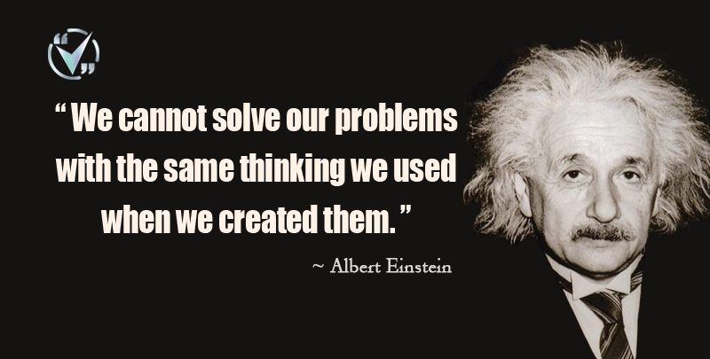

# ProblemSolving-repo
<pre>
Solving Problems from all sources available 
   •An-Najah National University
   •Data Structures and Algorithms Specialization by University of California and HSE University, Moscow, Russia.
   •HackerRank
   •Edabit
   •LeetCode
Each Directory Has:
   • The problem statement as a PDF file. (if there was no problem statment, try to search the name on LeetCode/Edabit)
   • The solution.
</pre>

